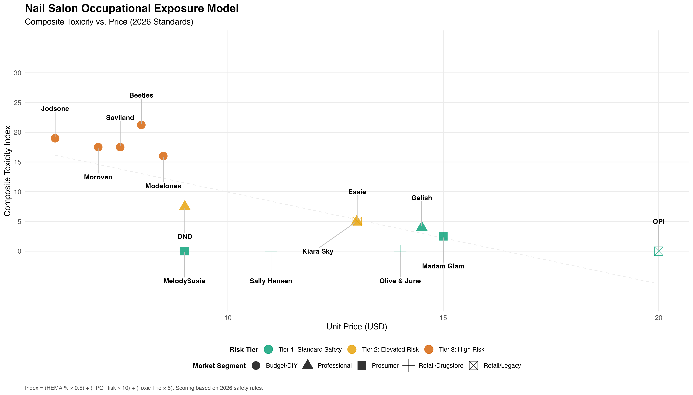

# nail-safety-toxicity-model
Quantitative modeling of ingredient-based exposure risk across consumer product tiers.

## Consumer Product Exposure Modeling

### Overview
This project explores potential variation in chemical exposure risk across different tiers of consumer nail products. The goal was to investigate whether pricing differences correlate with ingredient composition patterns and modeled exposure risk.

### Methods
* **Data Collection**: Compiled ingredient lists from publicly available product disclosures.
* **Standardization**: Standardized qualitative ingredient names into categorized compound groups.
* **Scoring**: Applied hazard-weighted scoring based on publicly available safety classifications.
* **Modeling**: Modeled relative exposure scores across product tiers.

### Tools Used
* **R Programming** (Data cleaning and standardization)
* **Weighted scoring framework**
* **Descriptive statistical comparison**

### Limitations
* Ingredient concentration transparency was limited.
* Hazard weighting relied on publicly available classifications rather than direct toxicological measurements.
* The model reflects relative risk scoring rather than clinical outcome prediction.

### Key Takeaway
Structured modeling revealed patterned differences in formulation choices across pricing tiers, demonstrating how quantitative frameworks can uncover trends not immediately visible in qualitative ingredient lists.
